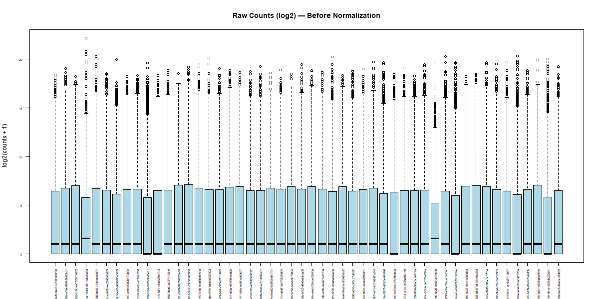
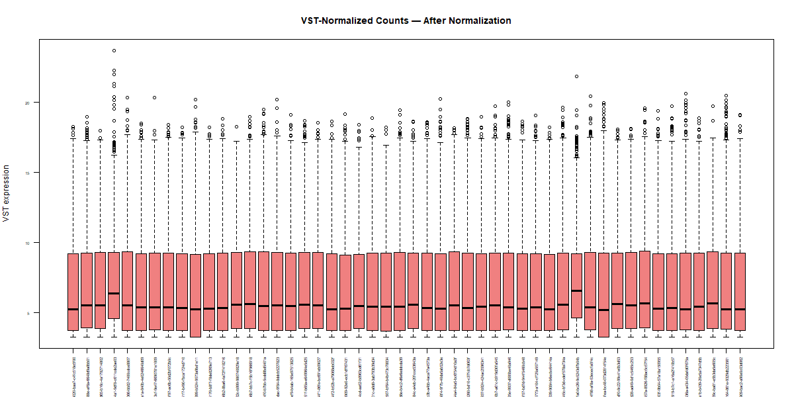
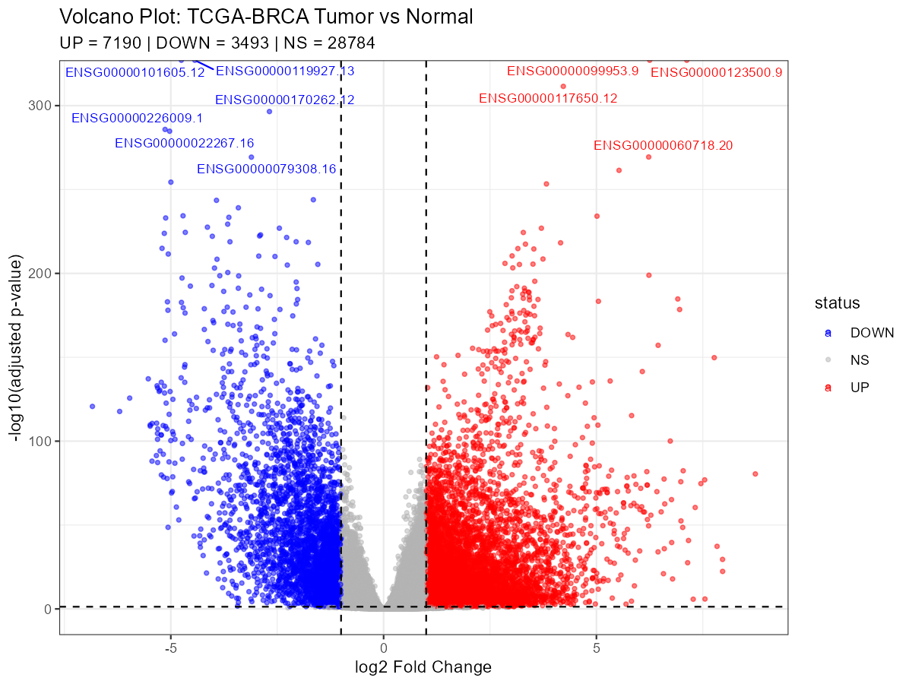
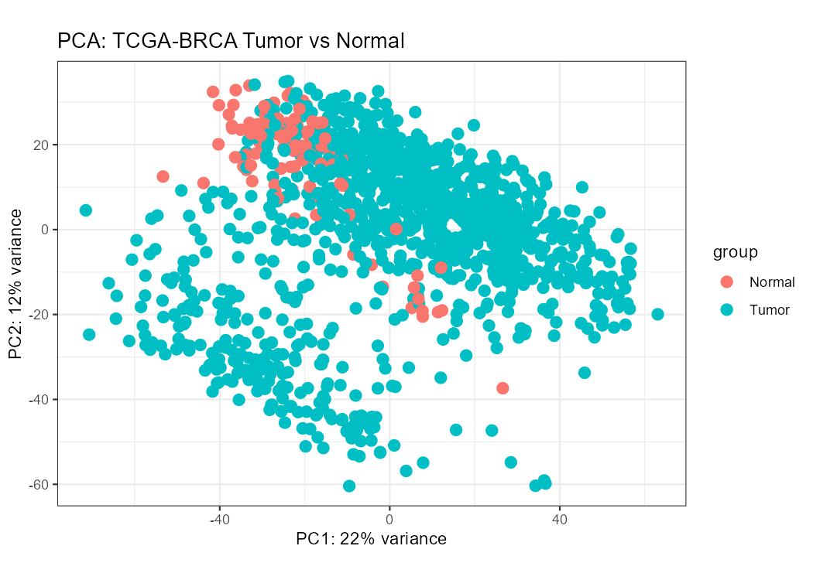
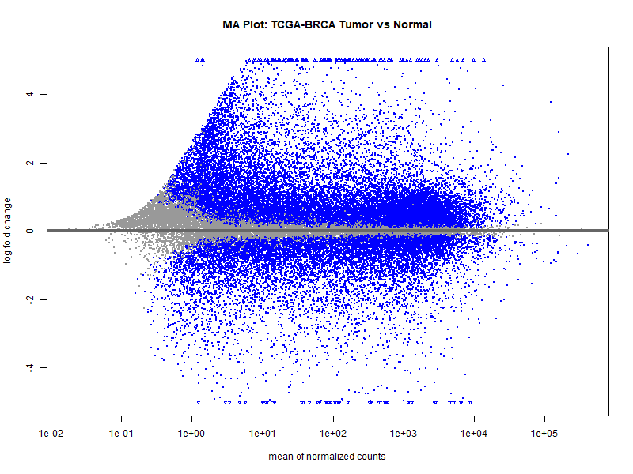
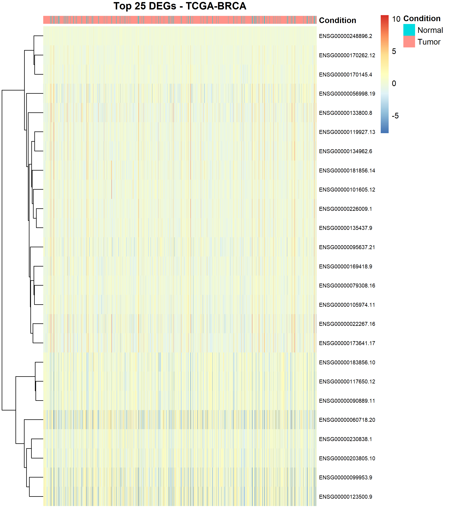
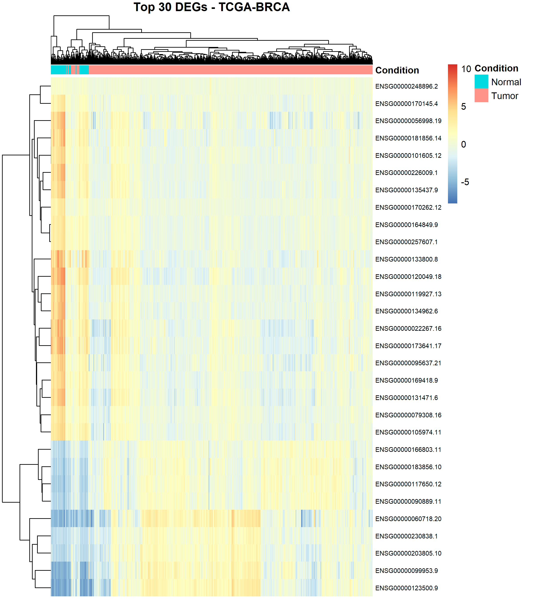

# TCGA-BRCA RNA-seq Differential Expression Pipeline (Tumor vs Normal)

A complete, beginner-friendly R pipeline for identifying differentially expressed genes (DEGs) between tumor and normal breast tissue using **TCGA-BRCA** RNA-seq data, accessed via `recount3` and analyzed with `DESeq2`.

Developed at the **Systems Biology & Data Analytics (SBDA) Lab, Amity Institute of Biotechnology, Amity University Noida**, as part of an internship mentoring project.

## Project Overview

- **Data type:** Bulk RNA-seq gene expression counts (Illumina platform)
- **Source:** TCGA-BRCA (The Cancer Genome Atlas – Breast Cancer), accessed via the `recount3` R package
- **Method:** DESeq2 differential expression analysis, Tumor vs Normal
- **DEG criteria:** `padj < 0.05` **and** `|log2FoldChange| > 1`
- **Outputs:** DEG results table (CSV) + 6 plots (boxplots before/after normalization, volcano plot, PCA, heatmap, MA plot)

## Repository Structure

```
├── scripts/
│   └── TCGA_BRCA_DESeq2_pipeline.R              # Full annotated pipeline script
├── docs/
│   ├── BRCA_RNAseq_Overview_Presentation.pptx   # Project overview slides
│   ├── DESeq2_Line_by_Line_Teaching_Notes.pptx  # Step-by-step teaching notes (slides)
│   └── DESeq2_Line_by_Line_Teaching_Notes.md    # Same notes, as Markdown (renders on GitHub)
├── results/                                     # Pipeline outputs (CSVs + plots)
└── README.md
```

## Results

Run on the full TCGA-BRCA dataset: **1,249 samples** (1,135 Tumor + 114 Normal) × **63,856 genes** (~39k after low-expression filtering) → **10,683 DEGs** (7,190 UP, 3,493 DOWN in Tumor vs Normal).

**Quality control — before vs after VST normalization:**

| Before | After |
|---|---|
|  |  |

**Volcano plot** — all filtered genes, UP (red) / DOWN (blue) / not significant (grey):



**PCA** — Tumor vs Normal separation:



**MA plot** — fold change vs mean expression:



**Heatmaps** — top DEGs, expression centered per gene:

| Top 25 DEGs (samples ordered by condition) | Top 30 DEGs (hierarchically clustered) |
|---|---|
|  |  |

Full result tables: [`DEG_results_TCGA_SIGNIFICANT_ONLY.csv`](results/DEG_results_TCGA_SIGNIFICANT_ONLY.csv) (10,683 DEGs only) and [`DEG_results_TCGA.csv`](results/DEG_results_TCGA.csv) (all ~39k filtered genes).

## How to Run

1. Open `scripts/TCGA_BRCA_DESeq2_pipeline.R` in RStudio.
2. Set your working directory to wherever you want results saved (`Session > Set Working Directory > Choose Directory`).
3. Run the whole script (`Source` button, or `Ctrl+A` then `Ctrl+Enter`).
4. The script takes ~15–30 minutes (data download + DESeq2 run). Do not close RStudio while it runs.
5. A `results/` folder will be created containing the DEG table (CSV) and plots (PNG).

### Requirements
- R (≥ 4.2 recommended)
- Packages: `recount3`, `DESeq2`, `ggplot2`, `pheatmap`, `ggrepel` (install instructions are included at the top of the script)

## Documentation

- **Overview presentation** ([`docs/BRCA_RNAseq_Overview_Presentation.pptx`](docs/BRCA_RNAseq_Overview_Presentation.pptx)) — background on NGS, TCGA-BRCA, and the analysis workflow, aimed at someone new to RNA-seq.
- **Line-by-line teaching notes** ([`docs/DESeq2_Line_by_Line_Teaching_Notes.md`](docs/DESeq2_Line_by_Line_Teaching_Notes.md)) — walks through all 17 steps of the pipeline script in detail, explaining the biological and statistical reasoning behind each block of code. Also available as slides.

## Author

Gunika — Bioinformatics Researcher, SBDA Lab, Amity Institute of Biotechnology
Supervised by Dr. Abhishek Sengupta

## License

MIT (or update to your preference)
